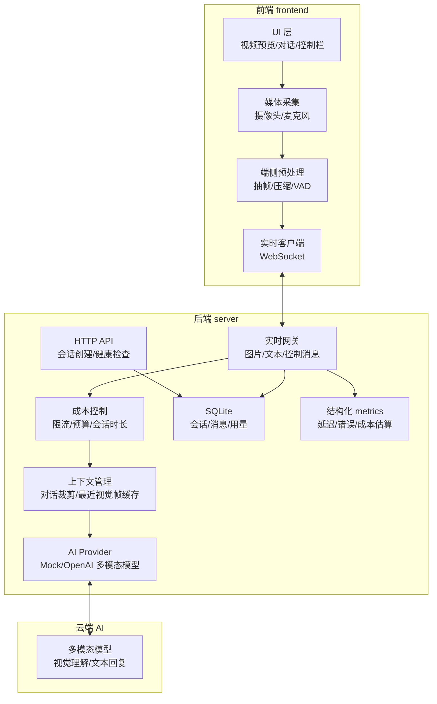

# AI 视觉对话助手：设计文档

## 架构图



## 用户故事计划与完成对照

| 用户故事 | 计划 | 当前状态 | 说明 |
| --- | --- | --- | --- |
| 用户可以启动 Web Demo | Phase 1 | 已完成 | `npm run dev` 同时启动前后端 |
| 用户可以授权摄像头和麦克风 | Phase 2 | 已完成 | `getUserMedia` 采集音视频 |
| 用户可以看到实时视频画面 | Phase 2 | 已完成 | `<video>` 本地预览 |
| 用户可以看到麦克风状态 | Phase 2 | 已完成 | Web Audio 计算音量 |
| 用户可以暂停、继续、结束 | Phase 2 | 已完成 | 暂停禁用 tracks，结束释放设备 |
| 用户可以完成一轮 mock 对话 | Phase 3 | 已完成 | WebSocket 发送文本，mock 流式回复 |
| 用户可以用语音输入问题 | Phase 4 | 已完成基础版 | 支持 Web Speech API 时转写为文本；不支持时使用 VAD 兜底触发 |
| 用户可以问“画面里有什么” | Phase 4 | 已完成基础版 | `AI_PROVIDER=openai` 时把最近视觉帧传给真实模型 |
| 用户可以听到 AI 回复 | Phase 4 | 已完成基础版 | 浏览器 SpeechSynthesis 播放 AI 文本 |
| 用户可以打断 AI 语音 | Phase 4 | 已完成基础版 | 控制栏“打断”停止浏览器 TTS |
| 系统能记住短上下文 | Phase 4 | 已完成基础版 | 后端裁剪保留最近 8 条文本消息 |
| 评委可以查看用量 | Phase 5 | 已完成基础版 | 前端显示帧数、音频秒数、消息数、估算成本 |
| 系统能输出运行指标 | Phase 5 | 已完成基础版 | 服务端结构化 metrics 日志记录延迟、错误、估算成本 |

## 成本策略想到与采用对照

| 策略 | 是否采用 | 当前实现 |
| --- | --- | --- |
| 不上传完整视频流 | 采用 | 前端只上传压缩 JPEG 帧 |
| 默认 1 帧/1.5 秒 | 采用 | `frameSampler.ts` 默认 `1500ms`，首帧从第一个周期开始，10 分钟最多 400 帧 |
| 图片宽度限制 512px | 采用 | Canvas 按宽度缩放 |
| 单帧小于 200KB | 采用 | 前端跳过超限帧，后端再次校验 |
| 单消息最大 512KB | 采用 | Fastify body limit 与 WebSocket 消息校验 |
| 单会话最长 10 分钟 | 采用 | 后端会话 `expiresAt` 校验 |
| 每 10 秒推送 usage | 采用 | 后端 WebSocket 默认 10 秒推送并落库一次 usage，烟测使用短间隔验证机制 |
| 数据库不保存原始媒体 | 采用 | SQLite 只存文本消息和用量事件 |
| 文本夹带媒体脱敏 | 采用 | 文本中的媒体 data URL、长 base64 和 Bearer token 入库前脱敏 |
| 最近视觉帧缓存 | 采用 | 只在内存保留最近 3 帧，会话结束时清空视觉缓存 |
| 对话上下文裁剪 | 采用 | 只在内存保留最近 8 条文本消息用于下一轮回复 |
| 结构化指标日志 | 采用 | 只记录事件、延迟、计数、估算成本和脱敏后的错误摘要 |
| 真实计费套餐 | 未采用 | 比赛 Demo 不做账号和计费系统 |
| 复杂模型路由 | 未采用 | 首版仅支持 `mock` 和 `openai` |

## 运行说明

```bash
npm install
npm run dev
```

打开 http://localhost:5173，点击“开始”，授权设备后输入“画面里有什么？”。

真实视觉模型模式：

```env
AI_PROVIDER=openai
OPENAI_API_KEY=你的后端模型 Key
OPENAI_MODEL=gpt-4.1-mini
```

后端健康检查：

```bash
curl http://localhost:4000/health
```

健康检查会返回当前 `provider` 模式，便于现场确认使用 `mock` 还是 `openai`，但不会返回 `OPENAI_API_KEY` 或其他密钥值。

创建和结束会话：

```bash
curl -X POST http://localhost:4000/api/sessions
curl http://localhost:4000/api/sessions/<sessionId>
curl -X POST http://localhost:4000/api/sessions/<sessionId>/end
```

会话查询接口用于现场确认状态和 usage，不返回视觉帧、音频片段或 data URL。

## 验收说明

- 本地启动：前后端可由根目录脚本启动。
- 自动烟测：`npm run verify` 可验证类型检查、构建、文档交付项、前端构建产物、OpenAI provider 离线 contract、根目录开发启动、后端离线演示链路和 npm 安全审计。
- 真实浏览器首屏：`npm run browser:smoke` 可临时启动 mock 后端和 Vite 前端，用 Playwright CLI 检查首屏 3 秒内可见、后端模式为 `mock`、关键面板存在、控制台无 error，并模拟拒绝摄像头/麦克风授权时不会创建后端会话或打开业务 WebSocket。
- 真实模型预检：配置 `OPENAI_API_KEY` 后运行 `npm run check:openai`，用脚本生成的红、绿、蓝三张 PNG 验证视觉输入链路，至少答对 2/3 才通过。
- 摄像头：授权后视频元素显示实时画面。
- 权限拒绝：拒绝摄像头或麦克风授权时，只显示错误提示，不创建后端会话。
- 会话失败：媒体授权后如果后端会话创建失败，前端释放设备并显示错误。
- 麦克风：音量条随输入变化；支持 Web Speech API 的浏览器会把语音转写为用户文本。
- 实时链路：前端通过 WebSocket 完成图片帧、音频片段、文本、控制消息发送和 AI 流式回复。
- 视觉理解：`openai` provider 使用最近视觉帧回答画面问题；现场等待“视觉帧已就绪”后使用“画面里有什么？/主要颜色是什么？/我手里拿着什么？”三题验收，至少答对 2/3。
- 现场记录：使用 `outputs/AI视觉对话助手-现场验收清单.md` 记录设备、三题结果、延迟、成本和隐私检查。
- 上下文管理：后端裁剪文本历史并传给 provider，避免无限累积上下文。
- 成本控制：后端限制会话时长、消息大小、图片频率和单帧大小。
- 隐私：数据库和日志不保存原始音频、图片、视频 base64。

## 未实现范围

- 未实现登录、多用户协作、套餐计费。
- `AI_PROVIDER=mock` 是默认演示模式；真实视觉问答需要配置后端 `OPENAI_API_KEY`。
- 未保存本地录制文件，不提供滤镜或原始媒体回放。
